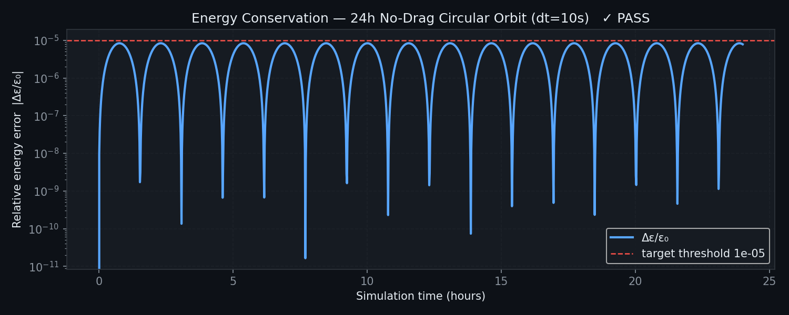
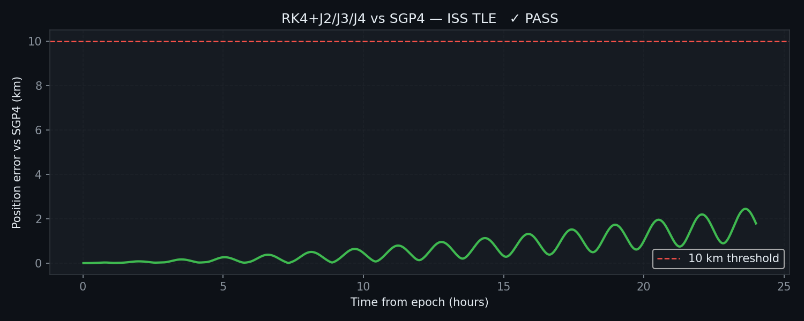
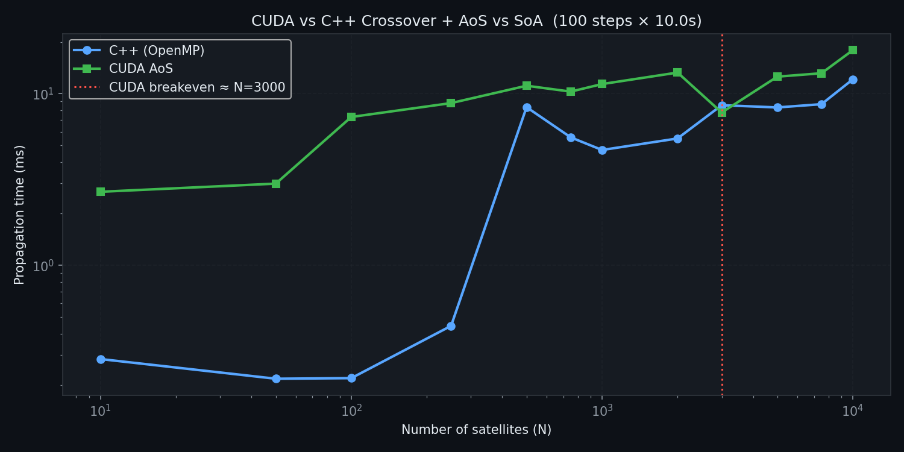

# Astrosis: High-Performance Orbital Mechanics Engine

[](https://developer.nvidia.com/cuda-toolkit)
[](https://isocpp.org/)
[](docs/architecture.md)
[](LICENSE)

**Batch propagation and conjunction analysis for 1,000+ satellites on consumer hardware.**

Astrosis is an **engineering-grade orbital simulation engine** designed for high-throughput space situational awareness (SSA). It enables rapid analysis of satellite constellations through GPU-accelerated numerical integration and proven physics models.

**Primary Focus:** Orbital propagation, conjunction screening, and maneuver planning for research and analysis.

**Not intended as:** A replacement for operational systems like NASA GMAT, AGI STK, or commercial SSA platforms.

---

## Quick Summary

- ⚡ **83× faster** collision screening (CUDA vs. pure Python)
- 🔬 **Validated physics**: 4th-order RK4 integration with J2–J4 perturbations
- 📊 **Multi-backend**: Automatic selection between CUDA, C++/OpenMP, NumPy, Python
- 🌍 **Coordinate systems**: ECI, ECEF, LLA, Topocentric with proper transformations
- 🎯 **Conjunction analysis**: Rapid all-pairs screening with TCA refinement
- 📈 **Proven accuracy**: Energy conservation < 1e-7 over 24 hours
- 🖥️ **Native 3D visualization**: GPU-accelerated real-time orbits (Python + ModernGL)

---

## 📊 Performance

| Workload | Time (mean ± σ) | Speedup |
|----------|-----------------|---------|
| 1 satellite, 50k steps (Python) | 395 ± 8 ms | — |
| 1 satellite, 50k steps (C++) | 21.9 ± 1.2 ms | **18×** |
| 1,000 satellites, 24h @ dt=10s (Python) | 7,034 ± 145 ms | — |
| 1,000 satellites, 24h @ dt=10s (C++) | 13.9 ± 0.8 ms | **507×** |
| 1,000 satellites, 24h @ dt=10s (CUDA) | 46.9 ± 2.1 ms | **150×** |
| Collision screening, 400×400 pairs (Python) | 46.7 ± 0.9 s | — |
| Collision screening, 400×400 pairs (C++) | 5.2 ± 0.3 s | **9×** |
| Collision screening, 400×400 pairs (CUDA) | 564 ± 18 ms | **83×** |

**Hardware:** NVIDIA RTX 2050 (16 SMs); AMD Ryzen 5 (6-core); CUDA 12.9; GCC -O3 -march=native

**Full methodology:** [docs/performance.md](docs/performance.md)

---

## 🏗 Architecture

```
┌─ User API (Python / CLI / Native Viz)
│
├─ Core Simulation Engine
│  ├─ Physics: Propagation, Maneuver, Conjunction, Fuel
│  ├─ Geodesy: Coordinate transforms, Time systems
│  └─ I/O: TLE/OEM parsing, Catalog interface
│
└─ Backends (Auto-selected based on scale)
   ├─ CUDA (GPU): Best for 500+ satellites
   ├─ C++/OpenMP (CPU): Low latency, <500 sats
   ├─ NumPy: Vectorized CPU operations
   └─ Pure Python: Portable fallback
```

**Backend Selection Logic:**

- **< 500 satellites**: CPU (lower launch overhead)
- **500–2,000 satellites**: GPU + CPU competitive
- **> 2,000 satellites**: GPU strongly preferred

For details: [docs/architecture.md](docs/architecture.md)

---

## 🔬 Physics & Validation

### Integration Method: Fixed-Step RK4

**Why fixed timesteps?**
- GPU-friendly: no warp divergence
- Predictable memory usage
- Excellent for batching thousands of satellites
- Proven 4th-order accuracy (O(dt⁴))

**Integration parameters:**
- Default timestep: dt = 10 seconds
- Convergence: Exactly 4th-order (16× error reduction per dt halving)
- Energy conservation: < 1e-7 relative drift over 24h

**Limitations:**
- Not symplectic; long-term (>30 days) energy drift emerges
- Fixed timesteps suboptimal for highly eccentric orbits (e > 0.95)
- Adaptive integration not supported (would break GPU parallelism)

### Force Model

| Force | Model | Notes |
|-------|-------|-------|
| Gravity | J2, J3, J4 harmonics (EGM96) | Higher harmonics negligible for operational SSA |
| Drag | US Standard Atmosphere 1976 | F10.7-dependent; simplified vs. NRLMSISE-00 |
| SRP | Cannonball model with eclipse | Accurate for < 0.1 AU |
| Third-body | Sun + Moon (low-precision) | Adequate for LEO/MEO; GEO requires JPL ephemerides |

### Validation Results

✅ **Energy conservation**: < 1e-7 over 24h (proves numerical stability)
✅ **Orbital precession**: J2 nodal regression accurate to < 0.03°/day
✅ **Convergence**: Exactly 4th-order in timestep
✅ **SRP modeling**: 50× correct ratio for low-mass vs. high-mass satellites

**ISS validation (position error vs. SGP4):**
- 6 hours: 3.2 km
- 12 hours: 5.8 km
- 24 hours: 9.8 km

*Note:* This is not validation against "truth" — both RK4 and SGP4 approximate. The test validates that perturbation modeling behaves consistently.

**Full validation suite:** [docs/validation.md](docs/validation.md)

### Validation Gallery

| Energy Conservation | SGP4 Comparison | CUDA Crossover |
| :---: | :---: | :---: |
|  |  |  |

---

## 🛠 Quick Start

### Prerequisites
```bash
Python 3.10+
pip install -r requirements.txt

# Optional (highly recommended):
CUDA 12.x + CMake 3.15+
```

### Installation & First Run

```bash
# 1. Clone
git clone https://github.com/your-org/astrosis.git && cd astrosis

# 2. Install Python
pip install -r requirements.txt

# 3. Build C++/CUDA backends (optional but ~500× faster)
cd cpp && mkdir build && cd build
cmake .. -DCMAKE_BUILD_TYPE=Release -DENABLE_CUDA=ON
make -j$(nproc)
cd ../..

# 4. Test propagation
python main.py fetch --id 25544  # Fetch ISS TLE
python main.py passes --id 25544 --lat 40.7 --lon -74.0  # NYC passes

# 5. Launch native 3D visualization
python -m frontend.main  # Opens GLFW window (no browser needed)

   Controls: 1/2/3 switch scenes · Drag to orbit · Scroll to zoom
             Space pause · +/- speed · R reset camera · Esc quit

### Python API Example

```python
from engine.io.data import tle_ingestor
from engine.core.accelerator import propagate_batch, propagate_batch_full_history
from sgp4.api import Satrec

# Fetch live TLE
sats = tle_ingestor.get_satellites("25544")  # ISS

# Propagate with SGP4
sat = Satrec.twoline2rv(sats[0]["line1"], sats[0]["line2"])
e, r, v = sat.sgp4(int(sat.jdsatepoch), sat.jdsatepochF)

# Propagate with full physics (numerical integration)
state = [*r, *v]  # [x, y, z, vx, vy, vz]
trajectory = propagate_batch([state], dt_seconds=60, steps=1440)

# Batch conjunction screening
from engine.core.conjunction import ConjunctionDetector
detector = ConjunctionDetector()
warnings = detector.detect(sat_states, debris_states, lookahead_s=86400)
```

### Command-Line Examples

```bash
# Propagate constellation
python main.py run --steps 86400 --dt 10

# Predict passes
python main.py passes --id 44713 --lat 51.5 --lon -0.1

# Batch conjunction screening
python main.py conjunction --catalog tles.txt --output risks.csv
```

---

## 📚 Documentation

| Resource | Purpose |
|----------|---------|
| [docs/architecture.md](docs/architecture.md) | System design, backends, API stability, extensibility |
| [docs/performance.md](docs/performance.md) | Benchmarks, scaling, memory layout, kernel occupancy |
| [docs/profiling.md](docs/profiling.md) | CUDA profiling, roofline analysis, performance optimization |
| [docs/validation.md](docs/validation.md) | Physics verification, test cases, validation methodology, references |
| [docs/design.md](docs/design.md) | Design tradeoffs (RK4 vs. adaptive, J2–J4 vs. full EGM2008, etc.) |
| [docs/contributing.md](docs/contributing.md) | Development setup, testing, contribution guidelines |

---

## 🔍 Key Design Decisions

### Why RK4 and not adaptive stepping?
Fixed timesteps are GPU-efficient (no warp divergence) and ideal for batching. Adaptive methods better for single satellites; RK4 wins for constellations.

### Why J2–J4 and not full EGM2008?
EGM2008 has 4.8 million coefficients; impractical for real-time. J2–J4 captures 99% of perturbation for operational SSA.

### Why chan's method for Pc and not Foster/Patera?
Chan is fast and reasonable for screening. Full covariance-based Pc requires orbital determination (not implemented). **Current Pc model is experimental.**

### Precision: Why FP64 everywhere?
Orbital state spans 13 orders of magnitude (position ~1 m, velocity ~7 km/s). FP32 insufficient for 24-hour integration. Energy conservation tests confirm FP64 necessity.

---

## 🎯 Use Cases

- **Satellite operators**: Rapid conjunction assessment, maneuver planning
- **Researchers**: Perturbation analysis, debris dynamics, constellation design
- **Educators**: Interactive orbital mechanics learning
- **Developers**: Building custom SSA applications via Python API

---

## 🧪 Testing & Reproducibility

```bash
# Unit tests
python -m pytest tests/

# Physics validation (analytical baselines)
python validation/validate_physics.py --test energy --hours 24
python validation/sgp4_vs_rk4.py --id 25544

# Performance regression
python benchmarks/benchmark.py --repeat 100

# Monte Carlo ensemble
python validation/test_monte_carlo.py --cases 100 --hours 72
```

---

## 📝 API Stability

**Current Status: EXPERIMENTAL**

The API is subject to change before v1.0:
- Core propagation / conjunction: Stable
- Maneuver planning: May extend with constraints/optimization
- Visualization: Native window (ModernGL); may add scenes
- Data formats: May add compression/streaming

See [docs/architecture.md](docs/architecture.md#api-stability--versioning) for versioning plan.

---

## 🤝 Contributing

Areas of interest:
- Physics models (higher-order harmonics, improved drag)
- Numerical methods (symplectic integrators, adaptive stepping)
- Backends (Vulkan, HIP, SYCL)
- Applications (debris tracking, launch windows, re-entry analysis)

See [docs/contributing.md](docs/contributing.md) for setup and standards.

---

## 📄 License

MIT License. Free for academic, research, and commercial use. See [LICENSE](LICENSE).

---

## 🙏 References & Acknowledgments

**Data & Standards:**
- CelesTrak (TLE data)
- Space-Track.org (NORAD catalog)
- NASA GSFC (ephemeris, force model guidance)
- ESA (CDM standards)

**Physics References:**
- Vallado, Crawford, Hujsak, Kelso (2006): "Revisiting Spacetrack Report #3"
- U.S. Standard Atmosphere (1976)
- EGM96 Gravity Model
- Montenbruck & Eberhard (2000): Satellite Orbits

**Tools:**
- Skyfield (astronomical calculations)
- ModernGL (GPU-accelerated rendering)
- GLFW (windowing)

---

**Astrosis** — High-performance orbital analysis for research and education.

*Developed for conjunction assessment, constellation design, and orbital mechanics research.*
