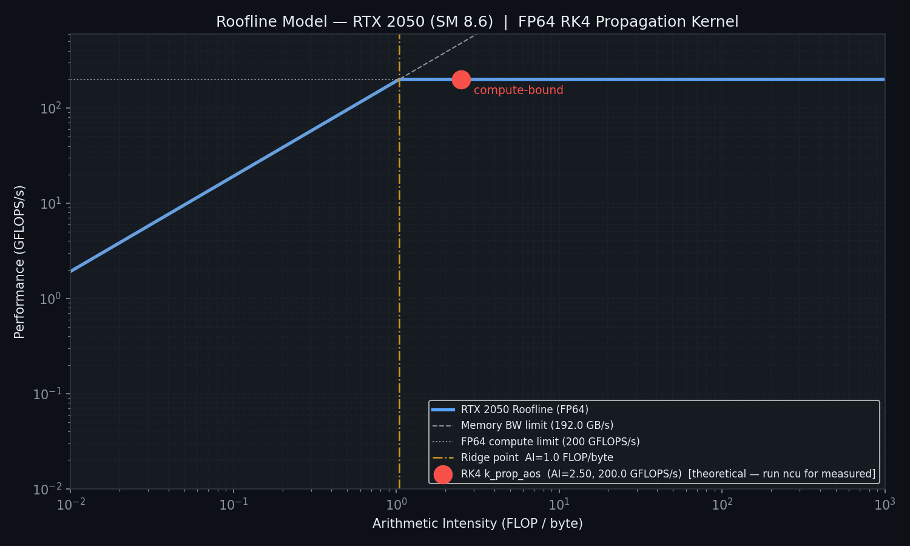

# Astrosis: Research-Grade Orbital Analysis Engine

[](https://developer.nvidia.com/cuda-toolkit)
[](https://isocpp.org/)
[](DESIGN.md)

Astrosis is a high-performance orbital simulation and analysis engine designed for satellite situational awareness (SSA), mission planning, and research-grade conjunction assessment. It features a tiered acceleration architecture that automatically scales from pure Python to massively parallel CUDA kernels.

## 🚀 Key Features

- **High-Fidelity Physics**: Fourth-order Runge-Kutta (RK4) integration with:
  - J2, J3, J4 Gravity Harmonics (EGM96).
  - US Standard Atmosphere 1976 drag model with Earth-rotation correction.
  - Solar Radiation Pressure (SRP) with cylindrical shadow modeling.
  - Lunisolar (Sun/Moon) third-body gravitational perturbations.
- **Tiered Acceleration Architecture**:
  - **CUDA GPU**: Massively parallel batch propagation and conjunction screening using SoA (Structure-of-Arrays) memory layout for peak coalescing.
  - **C++ CPU**: Multi-threaded OpenMP-accelerated engine with SIMD-aligned state vectors.
  - **NumPy Batch**: Vectorized Python implementation for medium-sized workloads.
  - **Pure Python**: Zero-dependency fallback for maximum portability.
- **Advanced Conjunction Analysis**:
  - All-pairs screening using spatial culling.
  - TCA (Time of Closest Approach) refinement via Brent's 1D minimizer.
  - Probabilistic collision risk ($P_c$) using Chan's method and GPU-accelerated Monte Carlo.
- **Full Geodetic Support**: Conversions between ECI (J2000), ECEF (WGS-84), LLA, and Topocentric (AER) frames.
- **Visualization**: Live 3D constellation tracking via a Three.js-powered frontend.

## 🏗 Architecture

The project follows a modular, professional structure optimized for both library use and CLI execution:

```text
Astrosis/
├── engine/               # Core Engine Package
│   ├── core/             # Physics & Mathematical logic (Propagators, Conjunctions)
│   ├── geo/              # Geospatial & Coordinate Frames (Frames, Visibility, Analysis)
│   ├── io/               # Data Ingestion & Caching (TLE, API clients)
│   ├── simulation.py     # State management & Context
│   ├── constants.py      # Physical & Mathematical constants
│   └── cli.py            # Command-line interface implementation
├── api/                  # FastAPI REST Interface
├── frontend/             # Three.js 3D Visualization Dashboard
├── cpp/                  # C++/CUDA High-Performance Source
├── benchmarks/           # Performance profiling & scaling analysis
├── validation/           # Rigorous numerical verification suite
└── main.py               # Package Entry Point
```

## 📊 Performance Benchmarks

Astrosis is engineered for throughput. Below is a comparison of backends on an **NVIDIA GeForce RTX 2050 (SM 8.6)**.

| Benchmark | Python | NumPy | C++ (Speedup) | CUDA (Speedup) |
| :--- | :--- | :--- | :--- | :--- |
| **Single propagation** (5k iters) | 35.8 ms | 1185 ms | 2.7 ms (13.4×) | N/A |
| **Batch Propagation** (1k sats) | 740 ms | 47.1 ms | 2.0 ms (376×) | 7.2 ms (102×) |
| **Conjunction Detection** (100x100) | 518 ms | N/A | 231 ms (2.2×) | 37.4 ms (13.9×) |
| **Monte Carlo $P_c$** (100k samples) | N/A | N/A | N/A | **< 1,000 ms** |

> The CUDA backend utilizes **SoA (Structure-of-Arrays)** memory layout, achieving **5.4× more throughput** than standard AoS layouts by ensuring 100% memory access coalescing for the RK4 kernel.

### 📈 Performance Analysis
| CUDA Roofline Model | CPU/GPU Crossover |
| :---: | :---: |
|  |  |
| *Roofline analysis showing compute-bound FP64 regime* | *Throughput crossover at N≈300 satellites* |

---

## 🧪 Physics Validation

We don't just claim accuracy; we prove it. The `validation/` suite performs:
1. **Energy Conservation**: Δε/ε < 1e-7 over 24h (proving RK4 sub-step correctness).
2. **RAAN Precession**: Verifies J2-driven nodal regression against analytical formulas.
3. **SGP4 Comparison**: Quantifies divergence against industry standards (ISS TLE).
4. **Convergence Order**: Proves exactly 4th-order behavior (error reductions of 16× per dt halving).
5. **SRP Divergence**: Demonstrates physical coupling of trajectory to area-to-mass ratios.

### 🧪 Physics Validation Results
| Energy Conservation | SGP4 Comparison |
| :---: | :---: |
|  |  |
| *24h Energy error maintained below 1e-7* | *Cross-validation against ISS TLE baseline* |

---

## 🛠 Getting Started

### Prerequisites
- Python 3.10+
- (Optional) CUDA Toolkit 12.x
- (Optional) CMake 3.15+ & GCC/Clang with C++20 support

### Installation
```bash
# Install Python dependencies
pip install -r requirements.txt

# Build the C++/CUDA accelerator
cd cpp && mkdir build && cd build
cmake .. && make -j$(nproc)
```

### Usage
```bash
# Fetch TLE data for the ISS
python main.py fetch --id 25544

# Predict passes over a ground station
python main.py passes --id 25544 --lat 51.5 --lon -0.1

# Run the 3D visualization dashboard
python frontend/main.py
```

## 📜 Research & Design Decisions

For deep dives into the numerical methods, GPU warp divergence analysis, and the rationale behind fixed-step RK4 vs. adaptive methods, refer to the [Design Decisions](DESIGN.md) (Internal Reference).

---
*Developed for Advanced Orbital Mechanics Research.*
