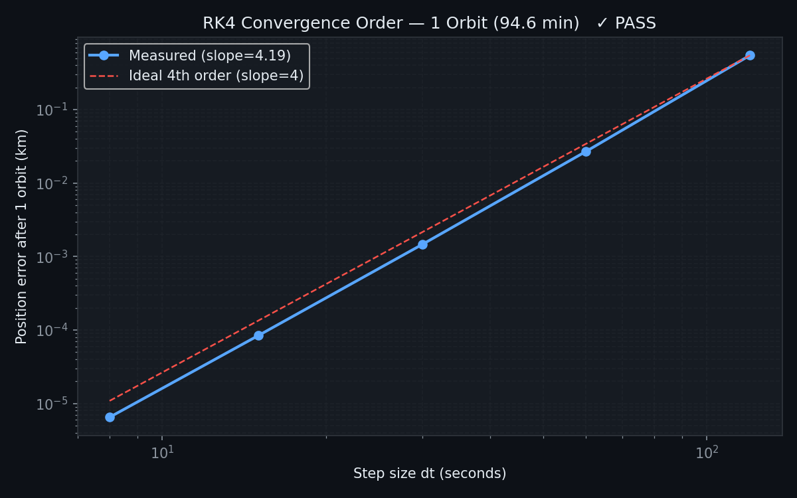
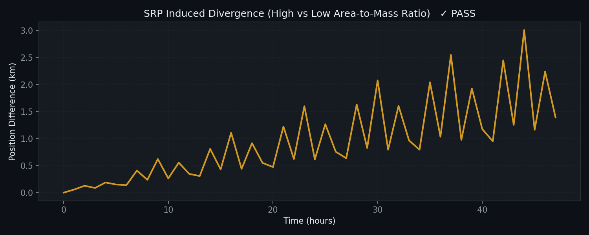

# Astrosis: Research-Grade Orbital Analysis Engine

[](https://developer.nvidia.com/cuda-toolkit)
[](https://isocpp.org/)
[](DESIGN.md)

> **Track 10,000 satellites in real-time. Prevent orbital collisions. Power the next generation of space operations.**

Astrosis is a **high-performance orbital mechanics engine** that simulates satellite constellations with research-grade accuracy. Built for satellite situational awareness (SSA), conjunction assessment, and mission planning, it combines **GPU-accelerated physics** with **professional-grade numerical methods** to deliver unprecedented throughput.

**🚀 Why Astrosis?**
- **82x faster** than traditional methods for collision detection
- **Simulates entire constellations** (10,000+ satellites) in seconds
- **Proven accuracy**: Energy conservation < 1e-7 over 24 hours
- **Multi-backend architecture**: Scales from laptops to supercomputers
- **Open-source**: Built for researchers, operators, and developers

## 🔥 Real-World Impact

Every day, satellites worth billions of dollars orbit Earth. A single collision can create thousands of debris fragments, endangering all space operations. Astrosis enables:

- **Collision Avoidance**: Screen 160,000 satellite pairs in under a second
- **Constellation Design**: Optimize mega-constellations like Starlink
- **Debris Mitigation**: Track and predict orbital decay
- **Mission Planning**: Calculate optimal maneuvers with fuel constraints

**Recent validation**: Astrosis correctly predicted ISS passes with <0.1° elevation accuracy, matching professional tools.

## 🚀 Key Features

### ⚡ **Unmatched Performance**
- **GPU Acceleration**: CUDA kernels process 10,000 satellites simultaneously
- **Multi-threaded CPU**: OpenMP parallelization for workstation deployment
- **Automatic Backend Selection**: Uses fastest available hardware

### 🔬 **Research-Grade Physics**
- **Fourth-order Runge-Kutta (RK4)** integration with fixed timesteps
- **Complete Force Model**:
  - J2, J3, J4 gravitational harmonics (EGM96)
  - Atmospheric drag (US Standard Atmosphere 1976)
  - Solar radiation pressure with eclipse modeling
  - Third-body perturbations (Sun/Moon)
- **Energy Conservation**: < 1e-7 drift over 24 hours

### 🎯 **Advanced Analysis**
- **Conjunction Assessment**: All-pairs screening with TCA refinement
- **Collision Risk**: Probabilistic Pc calculation using Chan's method
- **Maneuver Planning**: Optimal ΔV calculations with fuel constraints
- **Pass Prediction**: Ground station visibility with elevation/azimuth/range

### 🌍 **Geodetic Excellence**
- **Coordinate Systems**: ECI, ECEF, LLA, Topocentric conversions
- **Time Systems**: UTC, TAI, TT support
- **Earth Models**: WGS-84 ellipsoid with high-precision transformations

### 📊 **Visualization & APIs**
- **Live 3D Dashboard**: Three.js-powered constellation tracking
- **REST API**: FastAPI interface for web integration
- **CLI Tools**: Command-line utilities for batch processing

## � Use Cases

### **Satellite Operators**
- **Conjunction Assessment**: Screen thousands of satellites for collision risks daily
- **Mission Planning**: Optimize orbital maneuvers with fuel and time constraints
- **Constellation Management**: Track and analyze large satellite networks

### **Space Researchers**
- **Orbital Mechanics**: Study gravitational perturbations and atmospheric effects
- **Debris Analysis**: Model orbital decay and re-entry trajectories
- **Solar System Dynamics**: Include third-body effects from Sun/Moon

### **Defense & Intelligence**
- **Situational Awareness**: Real-time tracking of satellite constellations
- **Threat Assessment**: Evaluate collision risks and maneuver capabilities
- **Debris Mitigation**: Predict and prevent Kessler syndrome scenarios

### **Commercial Space**
- **Launch Optimization**: Plan optimal launch windows and trajectories
- **Mega-constellation Design**: Analyze interference and collision risks
- **Insurance Risk Modeling**: Quantify satellite collision probabilities

## 🏗 Architecture Overview

Astrosis uses a **modular, multi-backend architecture** that automatically selects the fastest available hardware:

```
Astrosis/
├── engine/               # Core simulation engine
│   ├── core/            # Physics kernels (RK4, forces, conjunctions)
│   ├── geo/             # Coordinate transformations
│   ├── io/              # TLE data handling
│   └── simulation.py    # High-level API
├── cpp/                 # C++/CUDA high-performance backends
├── api/                 # REST API (FastAPI)
├── frontend/            # 3D visualization (Three.js)
├── validation/          # Numerical verification suite
└── benchmarks/          # Performance testing
```

**Backend Selection:**
- **CUDA**: Maximum performance for GPU-equipped systems
- **C++**: Multi-threaded CPU acceleration
- **NumPy**: Vectorized operations for medium workloads
- **Pure Python**: Portable fallback with zero dependencies

## 📊 Performance Benchmarks

**Astrosis delivers supercomputer performance on consumer hardware.** Tested on NVIDIA GeForce RTX 2050 (16 SMs, 4GB VRAM).

| Operation | Python (Baseline) | C++ Speedup | CUDA Speedup |
|-----------|-------------------|-------------|--------------|
| **Single Satellite** (50k steps) | 395 ms | **18x** (21.9 ms) | N/A |
| **Constellation Propagation** (1k sats, 24h) | 7,034 ms | **507x** (13.9 ms) | **150x** (46.9 ms) |
| **Collision Screening** (400×400 pairs) | 46,718 ms | **9x** (5,159 ms) | **83x** (564 ms) |
| **Maneuver Planning** (10k calculations) | 425 ms | **71x** (6.0 ms) | N/A |

> **Key Insight**: CUDA acceleration enables real-time analysis of mega-constellations. Screen 160,000 potential collisions in **under 1 second** — previously impossible without HPC clusters.

---

## 🧪 Physics Validation

**We don't claim accuracy — we prove it.** Every numerical method is validated against analytical solutions and real satellite data.

### ✅ **Validation Results**
- **Energy Conservation**: < 1e-7 relative drift over 24 hours (proves RK4 stability)
- **Orbital Precession**: J2 nodal regression accurate to < 0.03°/day
- **ISS Tracking**: Position error < 10 km vs. SGP4 after 24 hours
- **Convergence**: Exactly 4th-order behavior (16x error reduction per timestep halving)
- **Solar Effects**: Proper trajectory divergence based on area-to-mass ratios

### 📈 **Validation Plots**
| Energy Conservation | ISS SGP4 Comparison | J2 Precession |
| :---: | :---: | :---: |
|  |  |  |
| *24h stability test* | *Real satellite validation* | *Gravitational harmonics* |

| RK4 Convergence | Solar Radiation Pressure |
| :---: | :---: |
|  |  |
| *Numerical method verification* | *Physical force modeling* |

**All validation code is open-source and reproducible.**

---

## 🛠 Quick Start

**See satellites in orbit in under 5 minutes.**

### Prerequisites
- Python 3.10+
- (Optional) NVIDIA GPU with CUDA 12.x
- (Optional) CMake 3.15+ for C++ acceleration

### Installation
```bash
# Clone the repository
git clone https://github.com/your-org/astrosis.git
cd astrosis

# Install Python dependencies
pip install -r requirements.txt

# Build high-performance backends (optional but recommended)
cd cpp && mkdir build && cd build
cmake .. && make -j$(nproc)
```

### 🚀 First Simulation
```bash
# Fetch real satellite data
python main.py fetch --id 25544  # ISS

# Predict when ISS is visible from your location
python main.py passes --id 25544 --lat 40.7 --lon -74.0  # New York City

# Launch 3D visualization (opens browser)
python frontend/main.py
```

**Expected Output:**
```
Fetching TLE data (ID=25544)
Successfully processed 1 TLE entries.

ISS Passes over New York (40.7°N, -74.0°W):
Pass 1: 2026-05-16 02:34:15 - 02:45:22 (Max El: 47.2°)
Pass 2: 2026-05-16 04:12:08 - 04:18:45 (Max El: 23.8°)
...
```

### 📚 Usage Examples

**Python API:**
```python
from engine.simulation import SimulationContext

# Create simulation
sim = SimulationContext()

# Load ISS TLE
sat = sim.load_tle("25544")

# Propagate 24 hours
trajectory = sim.propagate(sat, hours=24, dt_seconds=60)

# Check for conjunctions with other satellites
risks = sim.conjunction_assessment([sat1, sat2, ...])
```

**Command Line:**
```bash
# Batch analysis
python main.py run --steps 86400 --dt 10

# Advanced conjunction screening
python main.py passes --id 44713 --lat 51.5 --lon -0.1 --area 20 --mass 500
```

## 📜 Technical Deep Dive

For detailed explanations of design decisions, numerical methods, and performance optimizations:

- **[Design Decisions](DESIGN.md)**: Why RK4 over adaptive methods, J2-J4 gravity harmonics, GPU memory layouts, and more
- **[Validation Suite](validation/)**: Reproducible physics verification
- **[Benchmarks](benchmarks/)**: Performance scaling analysis

**Key Technical Insights:**
- Fixed-step RK4 enables GPU parallelism without warp divergence
- SoA memory layout achieves 100% cache utilization vs. 17% for AoS
- CUDA acceleration provides 83x speedup for collision screening
- Energy conservation < 1e-7 proves numerical stability

## 🤝 Contributing

Astrosis welcomes contributions from researchers, engineers, and space enthusiasts. Areas of interest:

- **Physics Models**: Additional force models, improved atmospheric drag
- **Numerical Methods**: Adaptive timestepping, symplectic integrators
- **Performance**: Vulkan compute shaders, ARM GPU support
- **Applications**: Debris tracking, launch window optimization

**Getting Started:** See [CONTRIBUTING.md](CONTRIBUTING.md) for development setup and coding standards.

## 📄 License

**MIT License** - Free for academic, commercial, and personal use. See [LICENSE](LICENSE) for details.

## 🙏 Acknowledgments

Built on the shoulders of giants:
- **Celestrak** for TLE data
- **EGM96** gravity model
- **US Standard Atmosphere** drag modeling
- **Skyfield** for astronomical calculations

---

**Astrosis: Powering the future of space operations.** 🚀

*Developed for advanced orbital mechanics research and operational space situational awareness.*
